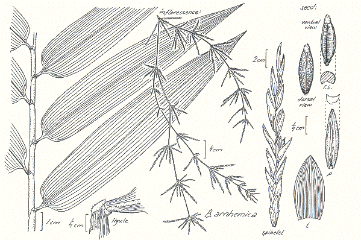

# Table of Contents

1.  [Bambusa](#bambusa)
    1.  [How it Works](#org9a0c799)
    2.  [The Workflow Rules](#orgd41b81a)
    3.  [Running the Workflow from the Git Commands](#org6422e14)
    4.  [Using the Client Scripts](#org9b0d10c)
2.  [Credits](#org6273e8c)
3.  [Similar Products](#org3dc1e0d)

# Bambusa

Bambusa is a free and open source distributed work management system
for tracking defects, issues and conversations. Bambusa is based on Git.

As software developers we are required to juggle many very detailed tasks simultaneously. Numerous ["Task Managment"](https://en.wikipedia.org/wiki/Task_management) systems have been built to 
to automate managment of tasks and share them amongst team members. There are many to choose from, they are often embedded in source control or other 
software packages - [there is a list on Wikipedia](https://en.wikipedia.org/wiki/Comparison_of_issue-tracking_systems). As a professional software developer I have used many of them, my current employer uses Jira, Trello and Azure Devops Boards.
Most of these issue trackers are centralized with an emphasis on access control suitable for corporate/organisational environments.

Bambusa has arisen from my daily use of Git for tracking my own work items. (The default back-end for Bambusa is the [Git](https://git-scm.com/) distributed version control system.) I have been using Git to track my work for some time, I offer this project to others who might find it useful. Bambusa has the following advantages over 'traditional' work item management systems:

-   Git is ubiquitous and is normally already installed wherever we work. In addition to command-line Git, usually there are centralised Git servers with web user interfaces. 'Installation' of Bambusa is either non-existent or just installation of some shell scripts.
-   Because Git is distributed, we can work on work items 'off-line' and synchronise up to a central server or collegue later.
-   Git automatically records who makes changes to a work item, their email identification and when the change was made. Changes can even be cryptographically signed.
-   Each work item includes all the working files associated with the item. Thus checking out an item to work on it gets us a complete workspace. (Central work item trackers can only upload and download files.) Bambusa is well suited to IT work where each work item collects files which may be data or code.
-   Some work items may require very large files to be associated with each work item. Git 'lfs' can be used to support these use cases.

## How it Works

Bambusa is an example of a 'Git workflow' such as 'Git flow' or 'Gitlab flow'. It is a set of conventions and rules about how Git is to be used backed by some helper scripts. We are using Git for a workflow which it was not initially designed for, but due to the excellence of the Git design it copes very well. It's all about leverage.

A 'project' is stored in a Git repository. Typically one would create a new Git repository when there are groupings of distinct work items which are unlikely to be related. For an individual, a single project can track all their work items.  

Each work item is held in a 'branch' in the project repository. The name of the branch is the title of the work item. To create a new work item, it suffices to create an (orphan) branch for it. To work on the item, one does a Git checkout of the branch. This provides a copy of all the latest files in flight for the work item. Thes could be documents, media, data files or code. 

To add a simple comment to a work item it suffices to make an empty Git commit. This can be pushed to remote repositories for storage and consumption by other team members. (use the `--allow-empty` commit switch.) A comment can also be made with accompanying changes to the files in the branch. This corresponmds to a comment with attachments in traditional work item systems. 

Clearly this is a very simple workflow, it can be done directly from the Git command-line. However some Git server tools and Git 'fat' clients are unable to create orphan branches or empty commits. 

## The Workflow Rules

Since the workflow is quite simple the rules described above are spelled out in a specification available in this repository here: [Bambusa Workflow Specification](./standard/bambusa-rfc.md). Any scripts or applications which conform to the standard are valid Bambusa implementations.

\#+TODO Write the workflow spec.

Workflow rules can be enforced by centralised Git servers in Git push hooks. Alternatively wrapper scripts which take care of the rules can be provided for local use. A reference cleint-side implementation is provided in this repository here: [Bambusa client reference](./src)

## Running the Workflow from the Git Commands

In this section we walk through how to create and operate work items with the Git CLI directly. As Git versions change, these commands may change. This document is using Git version 2.30.2. I find wrapper scripts are more convenient but an exploration of the fundamentals is essential.

\#+TODO write raw git section

## Using the Client Scripts

\#+TODO write the description of the client scripts

# Credits

-   [Illustration - Leaf and inflorescence details (line drawing) Copyright Darwin Herbarium by Monika Osterkamp Madsen](https://keys.lucidcentral.org/keys/v3/AusGrass/key/AusGrass/Media/Html/BAMBUSA/BAMARN.HTML)

# Similar Products

-   

